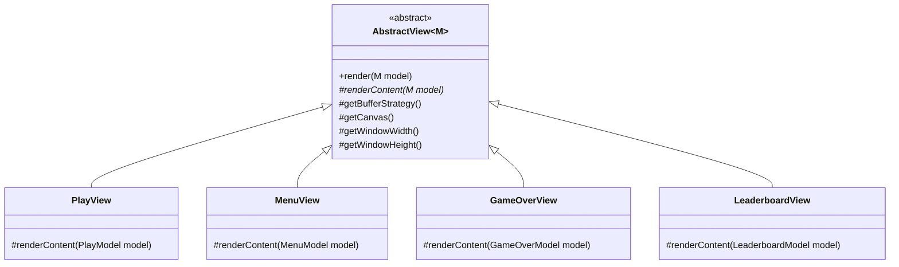

```mermaid
classDiagram
    class AbstractView~M~ {
        <<abstract>>
        +render(M model)
        #renderContent(M model)*
        #getBufferStrategy()
        #getCanvas()
        #getWindowWidth()
        #getWindowHeight()
    }

    class PlayView {
        #renderContent(PlayModel model)
    }

    class MenuView {
        #renderContent(MenuModel model)
    }

    class GameOverView {
        #renderContent(GameOverModel model)
    }

    class LeaderboardView {
        #renderContent(LeaderboardModel model)
    }

    AbstractView <|-- PlayView
    AbstractView <|-- MenuView
    AbstractView <|-- GameOverView
    AbstractView <|-- LeaderboardView
```
