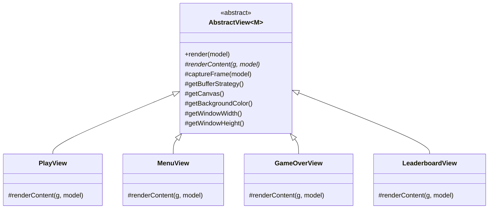

```mermaid
classDiagram
    class AbstractView~M~ {
        <<abstract>>
        +render(model)
        #renderContent(g, model)*
        #captureFrame(model)
        #getBufferStrategy()
        #getCanvas()
        #getBackgroundColor()
        #getWindowWidth()
        #getWindowHeight()
    }

    class PlayView {
        #renderContent(g, model)
    }

    class MenuView {
        #renderContent(g, model)
    }

    class GameOverView {
        #renderContent(g, model)
    }

    class LeaderboardView {
        #renderContent(g, model)
    }

    AbstractView <|-- PlayView
    AbstractView <|-- MenuView
    AbstractView <|-- GameOverView
    AbstractView <|-- LeaderboardView
```
