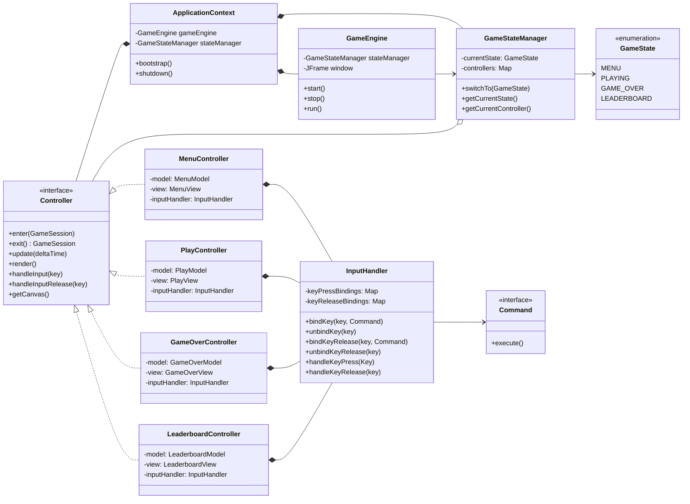

```mermaid
---
config:
  layout: dagre
---
classDiagram
direction LR
    class ApplicationContext {
	    -GameEngine gameEngine
	    -GameStateManager stateManager
	    +bootstrap()
	    +shutdown()
    }

    class GameEngine {
	    -GameStateManager stateManager
	    -JFrame window
	    +start()
	    +stop()
	    +run()
    }

    class GameStateManager {
	    -currentState: GameState
	    -controllers: Map
	    +switchTo(GameState)
	    +getCurrentState()
	    +getCurrentController()
    }

    class GameState {
	    MENU
	    PLAYING
	    GAME_OVER
	    LEADERBOARD
    }

    class Controller {
	    +enter(GameSession)
	    +exit() GameSession
	    +update(deltaTime)
        +render()
	    +handleInput(key)
	    +handleInputRelease(key)
	    +getCanvas()
    }

    class MenuController {
	    -model: MenuModel
	    -view: MenuView
	    -inputHandler: InputHandler
    }

    class PlayController {
	    -model: PlayModel
	    -view: PlayView
	    -inputHandler: InputHandler
    }

    class GameOverController {
	    -model: GameOverModel
	    -view: GameOverView
	    -inputHandler: InputHandler
    }

    class LeaderboardController {
	    -model: LeaderboardModel
	    -view: LeaderboardView
	    -inputHandler: InputHandler
    }

    class InputHandler {
	    -keyPressBindings: Map
	    -keyReleaseBindings: Map
	    +bindKey(key, Command)
	    +unbindKey(key)
	    +bindKeyRelease(key, Command)
	    +unbindKeyRelease(key)
	    +handleKeyPress(Key)
	    +handleKeyRelease(key)
    }

    class Command {
	    +execute()
    }

	<<enumeration>> GameState
	<<interface>> Controller
	<<interface>> Command

    Controller <|.. MenuController
    Controller <|.. PlayController
    Controller <|.. GameOverController
    Controller <|.. LeaderboardController
    MenuController *-- InputHandler
    PlayController *-- InputHandler
    GameOverController *-- InputHandler
    LeaderboardController *-- InputHandler
    InputHandler --> Command
    ApplicationContext *-- GameEngine
    ApplicationContext *-- GameStateManager
    GameEngine --> GameStateManager
    GameStateManager --> GameState
    Controller --* ApplicationContext
    Controller --o GameStateManager
```
