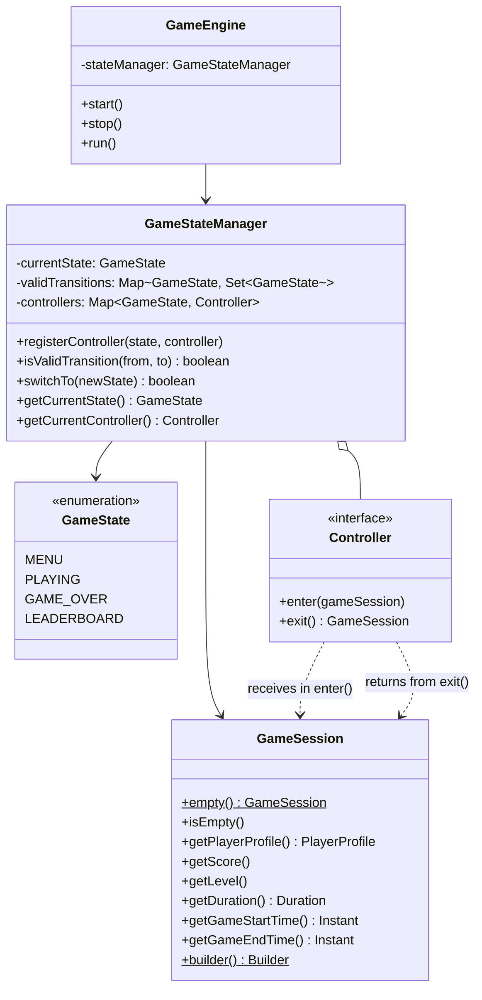

```mermaid
classDiagram
    class GameStateManager {
        -currentState: GameState
        -validTransitions: Map~GameState, Set~GameState~~
        -controllers: Map~GameState, Controller~
        +registerController(state, controller)
        +isValidTransition(from, to) boolean
        +switchTo(newState) boolean
        +getCurrentState() GameState
        +getCurrentController() Controller
    }

    class GameState {
        <<enumeration>>
        MENU
        PLAYING
        GAME_OVER
        LEADERBOARD
    }

    class Controller {
        <<interface>>
        +enter(gameSession)
        +exit() GameSession
    }

    class GameSession {
        +empty()$ GameSession
        +isEmpty()
        +getPlayerProfile() PlayerProfile
        +getScore()
        +getLevel()
        +getDuration() Duration
        +getGameStartTime() Instant
        +getGameEndTime() Instant
        +builder()$ Builder
    }

    class GameEngine {
        -stateManager: GameStateManager
        +start()
        +stop()
        +run()
    }

    GameStateManager --> GameState
    GameStateManager o-- Controller
    GameStateManager --> GameSession
    Controller ..> GameSession : receives in enter()
    Controller ..> GameSession : returns from exit()
    GameEngine --> GameStateManager
```
