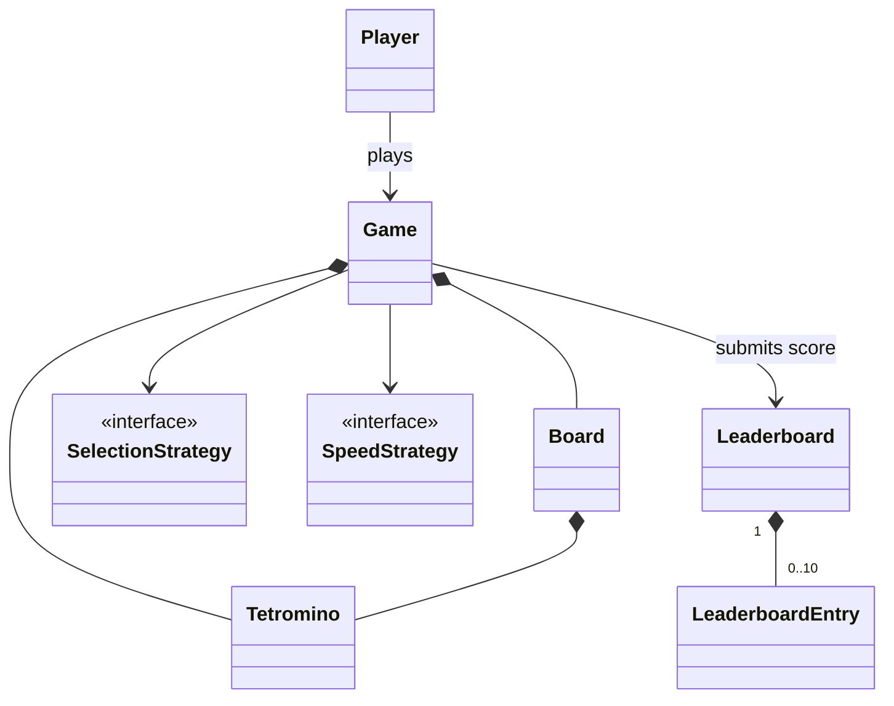

```mermaid
---
config:
  layout: dagre
---
classDiagram
    direction TB

    class Game {
    }

    class Board {
    }

    class Tetromino {
    }

    class SelectionStrategy {
        <<interface>>
    }

    class SpeedStrategy {
        <<interface>>
    }

    class Leaderboard {
    }

    class LeaderboardEntry {
    }

    class Player {
    }

    Game *-- Board
    Game *-- Tetromino
    Game --> SelectionStrategy
    Game --> SpeedStrategy
    Game --> Leaderboard : submits score
    Board *-- Tetromino
    Leaderboard "1" *-- "0..10" LeaderboardEntry
    Player --> Game : plays
```
