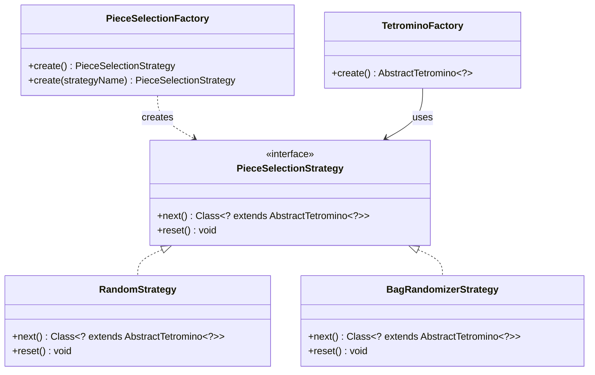

```mermaid
classDiagram
    class PieceSelectionStrategy {
        <<interface>>
        +next() Class~? extends AbstractTetromino~?~~
        +reset() void
    }

    class RandomStrategy {
        +next() Class~? extends AbstractTetromino~?~~
        +reset() void
    }

    class BagRandomizerStrategy {
        +next() Class~? extends AbstractTetromino~?~~
        +reset() void
    }

    class PieceSelectionFactory {
        +create() PieceSelectionStrategy
        +create(strategyName) PieceSelectionStrategy
    }

    class TetrominoFactory {
        +create() AbstractTetromino~?~
    }

    PieceSelectionStrategy <|.. RandomStrategy
    PieceSelectionStrategy <|.. BagRandomizerStrategy
    PieceSelectionFactory ..> PieceSelectionStrategy : creates
    TetrominoFactory --> PieceSelectionStrategy : uses
```
