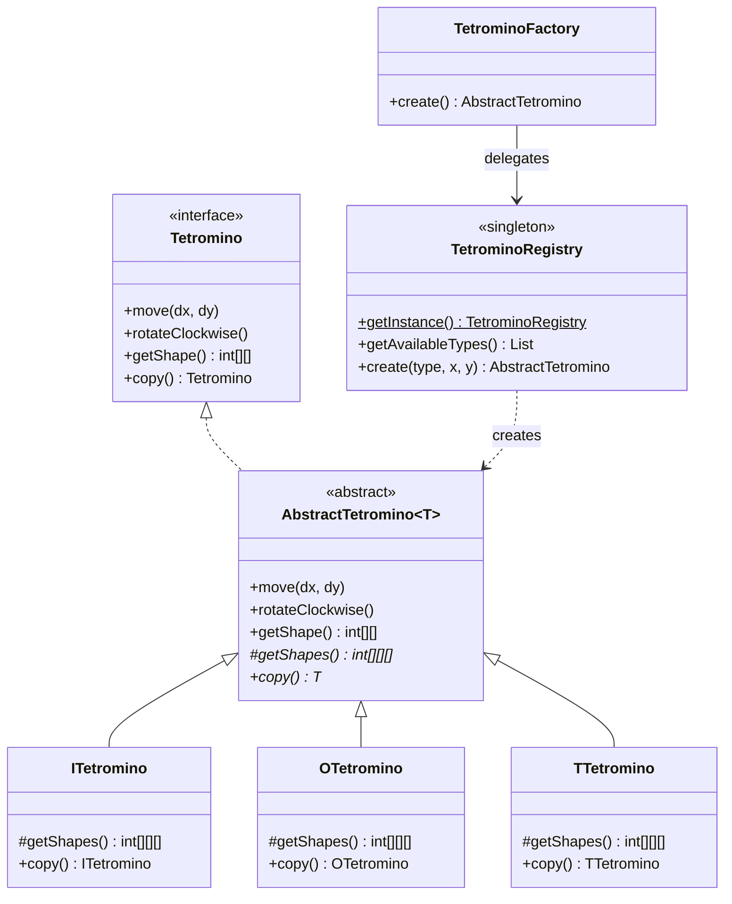

```mermaid
classDiagram
    class Tetromino {
        <<interface>>
        +move(dx, dy)
        +rotateClockwise()
        +getShape() int[][]
        +copy() Tetromino
    }

    class AbstractTetromino~T~ {
        <<abstract>>
        +move(dx, dy)
        +rotateClockwise()
        +getShape() int[][]
        #getShapes()* int[][][]
        +copy()* T
    }

    class ITetromino {
        #getShapes() int[][][]
        +copy() ITetromino
    }

    class OTetromino {
        #getShapes() int[][][]
        +copy() OTetromino
    }

    class TTetromino {
        #getShapes() int[][][]
        +copy() TTetromino
    }

    class TetrominoRegistry {
        <<singleton>>
        +getInstance()$ TetrominoRegistry
        +getAvailableTypes() List
        +create(type, x, y) AbstractTetromino
    }

    class TetrominoFactory {
        +create() AbstractTetromino
    }

    Tetromino <|.. AbstractTetromino
    AbstractTetromino <|-- ITetromino
    AbstractTetromino <|-- OTetromino
    AbstractTetromino <|-- TTetromino
    TetrominoFactory --> TetrominoRegistry : delegates
    TetrominoRegistry ..> AbstractTetromino : creates
```
